# JIRA Agile Metrics

A tool to extract Agile metrics and charts from JIRA projects and Trello Boards.

## Installation

Requires Python 3.6 or later.

Install Python 3 and the `pip` package manager. Then run:

    $ pip install jira-agile-metrics

You can do this globally, but you may want to use a virtual Python environment
(`venv`) instead to keep things self-contained.

See [The Hitchhiker's Guide to Python](http://python-guide.org/en/latest/) for
the full details about how to install Python and venvs.

This should install a binary called `jira-agile-metrics` in the relevant `bin`
directory. You can test it using:

    $ jira-agile-metrics --help

... which should print a help message.

### Using Docker

If you prefer, you can use [Docker](http://docker.com) to install and run
`jira-agile-metrics` with all the relevant dependencies in place. After
installing Docker, run:

    $ docker run -it --rm -v $PWD:/data optilude/jira-agile-metrics:latest config.yml

This will run `jira-agile-metrics` with the configuration file `config.yml` from
the current directory, writing outputs also to the current directory. The
argument `-v $PWD:/data` mounts the `/data` volume, where output files will be
written, to the current working directory. You can of course specify a
different bind mount.

### Using Docker in batch mode

There is a second Docker image, which can be used to run multiple config files
in batch mode, for example to generate metrics overnight.

To use it, create a directory containing one or more configuration files, with
the extension `.yml` or `.yaml`, and a _different_ directory for the outputs.
Assuming these are `/path/to/config` and `/path/to/output`, you can run
the following Docker command periodically, e.g. using `cron` or another
scheduler:

    $ docker run --rm -v /path/to/config:/config -v /path/to/output:/data optilude/jira-agile-metrics:batch-latest

When this is finished, you should see a directory under the `output` directory
for each of the config files in the `config` directory, containing the reports
and charts. You will also find a file called `metrics.log` containing the log
output during the run, which may be helpful in diagnosing any problems.

Any command line arguments passed to `docker run` after the image name will be
passed directly to `jira-agile-metrics`. So, for example, if you wanted to use
the `-n` option to limit the number of results fetched from JIRA (for testing
purposes), you can pass `-n 10` (or some different number) at the end of the
command line above.

## Usage

The basic usage pattern is to run `jira-agile-metrics` with a configuration
file, written in YAML format (see below), which describes:

- how to connect to a remote JIRA or Trello instance (this can also be set 
  using command line options);
- what metrics (spreadsheet-like data files, charts as images) to output;
- various settings used to calculate those metrics; and
- a description of the stages of the workflow the relevant JIRA tickets go
  through.

The tool will then connect to JIRA or Trello using its web services API, run a 
query to the relevant tickets and their history, and calculate the required 
metrics.

The outputs are written to local filesystem files. Data files can be written in
CSV, XLSX or JSON formats (depending on the extension of the desired output
file), whilst charts are written as PNG images.

### Server mode

`jira-agile-metrics` comes with a simple web server that can be used to produce
metrics by uploading a configuration file and downloading a ZIP file with data
and charts. To start it, run:

    $ jira-agile-metrics --server 5000

This will start a server on port `5000` (you can also specify a bind host name
or IP address, e.g. `0.0.0.0:5000`). Visit this address in a web browser and
upload a file.

In this mode, all other command line options are ignored.

**Note:** The web server is designed for low-volume usage only, and does not
have a sophisticated security model. It is simply a more accessible front end
to the features of the command line tool. The server will wait, synchronously,
whilst JIRA is queried and charts are produced, which can take a long time.
During this time, the browser will wait, and threads will block.

**Warning:** The web server does not encrypt requests, which means that by
default JIRA/Trello credentials are transmitted in plain-text. You are strongly 
advised to configure a reverse proxy (e.g. `nginx`) with SSL enabled in front 
of it.

#### Using Docker to run the web server

There is a separate Docker image for running the web server, which uses `nginx`
and `uwsgi` for improved performance and stability (but still not SSL, which
would need to be configured with a domain-specific certificate):

    $ docker run -d --rm -p 8080:80 --name jira_metrics optilude/jira-agile-metrics:server-latest

This will run the server in daemon mode and bind it to port `8080` on the local
host. To stop it, run:

    $ docker stop jira_metrics

See the [Docker documentation](https://docs.docker.com) for more details.

### An important note about JIRA authentication

The tool uses a simple username/password combination to connect to JIRA. You
need to ensure this user exists in the remote JIRA instance, and has the
required permissions. A JIRA API token can be used in the place of 
a password.

There are three ways to provide the credentials for JIRA -- in particular, the
password, which should be kept scret. You should think carefully about which
approach makes most sense for you.

- Generate an API token for your user in 
  [JIRA settings](https://confluence.atlassian.com/cloud/api-tokens-938839638.html)
  and use this API token instead of password in your scripts
- Creating API token is mandatory if your Atlassian account is based on
  a single sign on like Google 
- The safest option is to not set it in either the configuration file, or as
  a command line option. In this case, you will be prompted to input a
  password (and username, if you didn't set this either) each time the tool
  is run.
- You can use the `--username` and/or `--password` command line options to set
  credentials when you invoke the `jira-agile-metrics` command. This keeps
  them out of the configuration file, but if you do this in an interactive
  shell that records command history (i.e. virtually all of them), your
  password will likely be stored in plain text in the command history!
- If you are confident you can keep the configuration file secret, you can
  store them there, under the `Connection` section (see below).
  
Example how to connect with username and API token:

```sh
# Connects with an API token that is passed on --password argument
jira-agile-metrics --username your-email@example.com --password CGI... config.yml
```

For Trello the tool uses a username plus an [API Key/Token](https://trello.com/app-key)
pair. You need to ensure this user exists in the remote Trello instance,
and has the required permissions.

Example how to connect with username and API token:

```sh
# Connects with an API token that is passed on --password argument
jira-agile-metrics --username your-email@example.com --key 6d1658b... --token a7d6b34... config.yml
```

 
### What issues should you include?

The most common use case is to calculate metrics for a team using a JIRA issue
type called something like `Story`, going through a workflow with stages like
`Backlog`, `Committed`, `Elaboration`, `Build`, `Code review`, `Test`, and `Done`,
and allowing a set of resolutions like `Completed`, `Withdrawn`, and `Duplicate`.

`jira-agile-metrics` lets you use JIRA JQL syntax to specify which issues you
are interested in. See the JIRA documentation for more details (or construct a
search using the JIRA UI and then have JIRA show you the corresponding JQL).

### Creating a configuration file - JIRA

Here is an example JIRA configuration file for a basic example using the workflow
above:

    # How to connect to JIRA. Can also include `Username` and `Password`
    Connection:
        Domain: https://myjira.atlassian.net # your JIRA instance
        # bypass JIRA API call for the server version endpoint 
    #   Jira server version check: False

    # What issues to search for. Uses JQL syntax.
    Query: Project=ABC AND IssueType=Story AND (Resolution IS NULL OR Resolution IN (Completed, Withdrawn))

    # The workflow we want to analyse. By convention, the first stage should be
    # the backlog / initial state, and the final stage should indicate the work
    # is done.
    #
    # We map analytics names to JIRA status names. It's possible to collapse
    # multiple JIRA statuses into a single workflow stage, as with `QA` below.
    Workflow: 
        Backlog: Backlog
        Committed: Committed
        Elaboration: Elaboration
        Build: Build
        QA:
            - Code review
            - Test
        Done: Done
    
    # What outputs to produce. These are all optional. If an option isn't set
    # the relevant metric will not be produced.

    Output:

        # CSV files with raw data for input to other tools or further analysis in a spreadsheet
        # If you use .json or .xlsx as the extension, you can get JSON data files or Excel
        # spreadsheets instead

        Cycle time data:
            - cycletime.csv
            - cycletime.json
        CFD data: cfd.csv
        Scatterplot data: scatterplot.csv
        Histogram data: histogram.csv
        Throughput data: throughput.csv
        Percentiles data: percentiles.csv

        # Various charts

        Scatterplot chart: scatterplot.png
        Scatterplot chart title: Cycle time scatter plot
        
        Histogram chart: histogram.png
        Histogram chart title: Cycle time histogram
        
        CFD chart: cfd.png
        CFD chart title: Cumulative Flow Diagram
        
        Throughput chart: throughput.png
        Throughput chart title: Throughput trend
        
        Burnup chart: burnup.png
        Burnup chart title: Burn-up

        Burnup forecast chart: burnup-forecast.png
        Burnup forecast chart title: Burn-up forecast
        Burnup forecast chart trials: 100 # number of Monte Carlo trials to run to estimate completion date

        # Burnup forecast chart throughput window: 60 # Days in the past to use for calculating historical throughput
        # Burnup forecast chart throughput window end: 2018-06-01 # Calculate throughput window to this date (defaults to today)
        # Burnup forecast chart target: 100 # items to complete in total; by default uses the current size of the backlog
        # Burnup forecast chart deadline: 2018-06-01 # deadline date, in ISO format; if not set, no deadline is drawn.
        # Burnup forecast chart deadline confidence: .85 # percentile to use to compare forecast to deadline
        
        WIP chart: wip.png
        WIP chart title: Work in Progress

        Ageing WIP chart: ageing-wip.png
        Ageing WIP chart title: Ageing WIP

        Net flow chart: net-flow.png
        Net flow chart title: Net flow

Hint: If you prefer to manage your queries as saved filters in JIRA, you can
use the special JQL syntax of `filter=123`, where `123` is the filter ID.

If you save this file as e.g. `config.yaml`, you can run:

    $ jira-agile-metrics config.yaml

This should prompt you for a username and password, and then connect to your
JIRA instance, fetch the issues matching the query, calculate metrics, and
write a number of CSV and PNG files to the current working directory (you can
use the `--output-directory` option to write to another directory).

When testing configuration, it is often helpful to fetch just a small number of
issues to speed things up. You can either do this by making your query more
restrictive, or by using the `-n` flag to limit the number of issues fetched:

    $ jira-agile-metrics -n 20 config.yaml

If you want more information about what's going on, use the `-v` flag:

    $ jira-agile-metrics -v config.yaml

And if you are realy curious:

    $ jira-agile-metrics -vv config.yaml

### Creating a configuration file - Trello

If you are using Trello then your configuration file needs to look like this:

    Connection:
        type: trello

    # Board to get data from
    Query: Web Services


## Reusing elements of a config file

If you want to reuse some configuration elements (e.g., `Connection`,
`Workflow`) across multiple configuration files, you can use the `Extends`
option to "import" one file into another.

For example, if you had a file called `common.yaml` with:

    Connection:
        Domain: https://myjira.atlassian.net

    Workflow: 
        Backlog: Backlog
        Committed: Committed
        Elaboration: Elaboration
        Build: Build
        QA:
            - Code review
            - Test
        Done: Done
    
    Output:

        Quantiles:
            - 0.5
            - 0.75
            - 0.95

Another file, e.g. `team1.yaml`, could then reuse these settings with:

    Extends: common.yaml

    Output:
        Cycle time data: team1-cycletime.csv
        CFD chart: team1-cfd.png
        CFD chart title: Team 1: CFD

The extended filename is resolved relative to the file being loaded, so in
this example they would be in the same directory. You can use relative or
absolute paths. Note that the path separator for relative paths is always `/`
(forward slash), even on Windows!

When one file extends another, the extending file can override any options
set in the extended file. So, for example, if `team1.yaml` also set `Quantiles`
under `Output`, the list from `common.yaml` would be overridden in its entirety.
This is the case for any option under `Output`, and for the `Query` / `Queries`
and `Workflow` options in their entirety. Any `Attributes` will be merged.

You can use `Extends` recursively, i.e. an extended file can extend another
file.

**Note:** The `Extends` feature is not available in server mode. If a file with
an `Extends` line is uploaded to the server, an error will be thrown.

## Available metrics

`jira-agile-metrics` can produce a number of data files and charts, which can
be enabled in the `Output` section of the configuration file, or with a
corresponding command line option.

**Note:** In the configuration file, you can specify output file *names*, but
not absolute or relative paths. Files will always be written to the current
working directory. This is to prevent unexpeced behaviour and the potential of
overwriting other files when configuration files are moved around or used on
a remote machine. No such restriction applies to output files specified in
command line arguments.

### Cycle time details

Details about each ticket and the date it entered each stage of the workflow.
Both the CSV and JSON versions of this file can be used by the
[Actionable Agile Analytics](http://actionableagile.com/) tool, which offers
powerful, interactive analysis of Agile flow.

In the configuration file:

    Output:
        Cycle time data: cycletime.csv

You can also use `.json` or `.xlsx` formats. To output multiple files, use a
list like:

    Output:
        Cycle time data:
            - cycletime.json
            - cycletime.xlsx
            - cycletime.csv

Note: the "Blocked Days" calculation relies on the "Flagged" feature in JIRA,
showing the total number of days (rounded up to the nearest whole day) that each
ticket was flagged as impeded. Impediments raised whilst the ticket is in the
backlog or done do not count.

### Cumulative Flow Diagram (CFD)

Raw data for creating a valid Cumulative Flow Diagram, in spreadsheet format,
and/or an image file of the same. The CFD shows the number of work items in
each stage of the flow as a stacked area chart, day by day. This allows us to
visualise WIP, cycle time, and throughput.

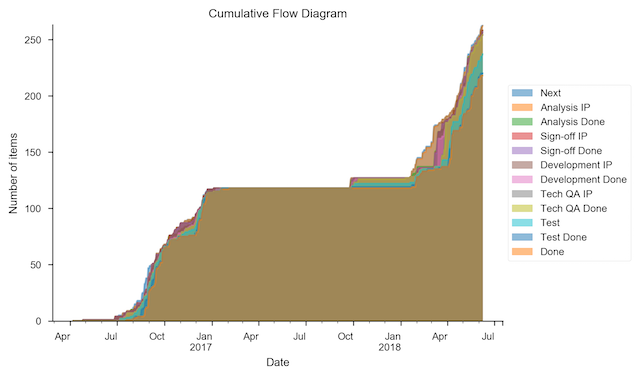

In the configuration file:

    Output:
        CFD data: cfd.csv
        CFD chart: cfd.png
        CFD chart title: Cumulative Flow Diagram

You can also use `.json` or `.xlsx` formats for the data file.  To output
multiple files, use a list like:

    Output:
        CFD data:
            - cfd.json
            - cfd.xlsx
            - cfd.csv

To only show the 30 most recent days in the chart:

        CFD window: 30

### Cycle time scatter plot

Raw data for creating a valid Cycle Time scatter plot graph, and/or an image
file of the same. This chart plots the end-to-end cycle time (excluding time
spent in the backlog) for each work item against its completion date, and
overlays quantiles (e.g. 85% of tickets took 18 days or fewer)

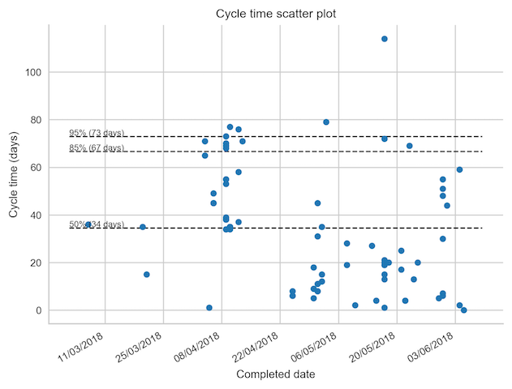

In the configuration file:

    Output:
        Scatterplot data: scatterplot.csv
        Scatterplot chart: scatterplot.png
        Scatterplot chart title: Cycle time scatter plot

You can also use `.json` or `.xlsx` formats for the data file. To output
multiple files, use a list like:

    Output:
        Scatterplot data:
            - scatterplot.json
            - scatterplot.xlsx
            - scatterplot.csv

By default, the quantiles used are the 50th, 85th and 95th percentile, but you
can specify a different list with the `Quantiles` option under `Output`:

        Quantiles:
            - 0.3
            - 0.5
            - 0.75
            - 0.85
            - 0.95

Note that this option affects all charts that use quantiles.

To get the quantile values (number of day at each quantile) in a data file, use:

        Percentiles data: percentiles.csv

To only show the 30 most recent days in the chart:

        Scatterplot window: 30

### Cycle time histogram

This is a different view of the cycle time , calculatd and/or plotted as a
histogram.

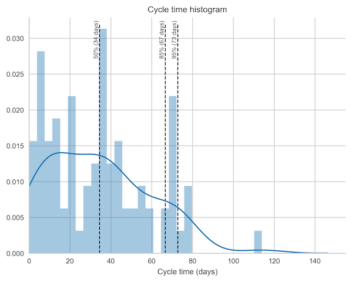

In the configuration file:

    Output:
        Histogram data: histogram.csv
        Histogram chart: histogram.png
        Histogram chart title: Cycle time histogram

You can also use `.json` or `.xlsx` formats for the data file. To output
multiple files, use a list like:

    Output:
        Histogram data:
            - histogram.json
            - histogram.xlsx
            - histogram.csv

This also respects the `Quantiles` option (see above).

To only show the 30 most recent days in the chart:

        Histogram window: 30

### Throughput

Weekly throughput, i.e. the number of items completed week by week. The chart
also shows a trend line.

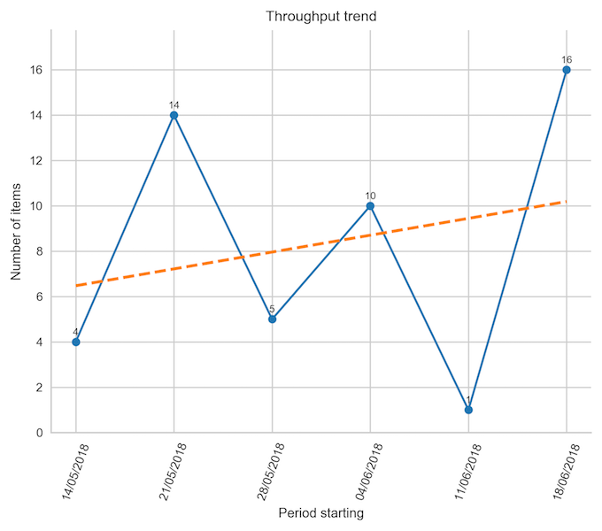

In the configuration file:

    Output:
        Throughput data: throughput.csv
        Throughput chart: throughput.png
        Throughput chart title: Throughput trend

You can also use `.json` or `.xlsx` formats for the data file.

To change the frequency from weekly to something else, use:

        Throughput frequency: 1D

Here, `1D` means daily. The default is `1W-MON`, which means weekly starting on
Mondays.

To only show the 6 most recent periods (e.g. weeks) in the chart:

        Throughput window: 6

### WIP box plot

Shows a box plot of WIP, week by week (or some other frequency).

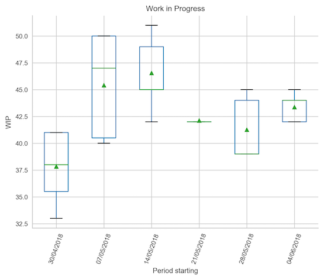

In the configuration file:

        WIP chart: wip.png
        WIP chart title: Work in Progress

To change the frequency from weekly to something else, use:

        WIP frequency: 1D

Here, `1D` means daily. The default is `1W-MON`, which means weekly starting on
Mondays.

To only show the 6 most recent periods (e.g. weeks) in the chart:

        WIP window: 6

### Net flow chart

Shows the difference between arrivals and departures week on week. In a
perfectly stable system, the net flow would be 0.


In the configuration file:

        Net flow chart: net-flow.png
        Net flow chart title: Net flow

To change the frequency from weekly to something else, use:

        Net flow frequency: 1D

Here, `1D` means daily. The default is `1W-MON`, which means weekly starting on
Mondays.

To only show the 6 most recent periods (e.g. weeks) in the chart:

        Net flow window: 6

### Ageing WIP chart

Shows the cycle time to date for each work item, grouped into the stages of
the workflow. This can help identify slow-moving tickets.

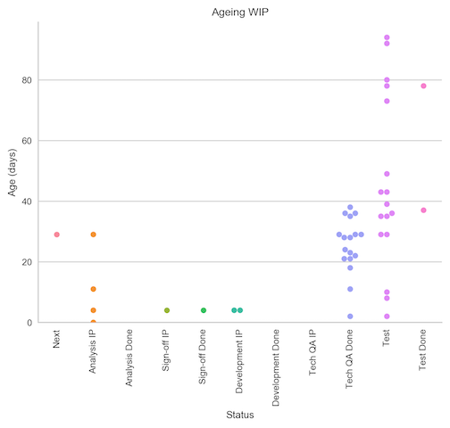

In the configuration file:

        Ageing WIP chart: ageing-wip.png
        Ageing WIP chart title: Ageing WIP

### Burn-up chart

A basic Agile burn-up chart, based on a count of items completed and in the
backlog.

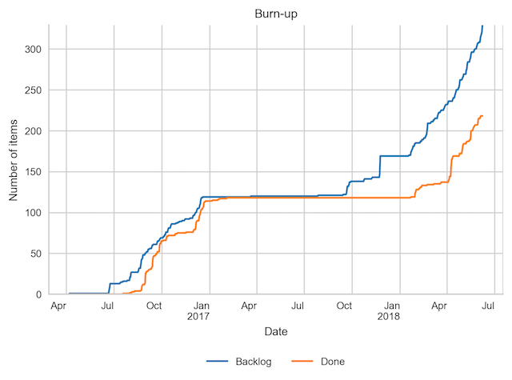

In the configuration file:

        Burnup chart: burnup.png
        Burnup chart title: Burn-up

To only show the 30 most recent days in the chart:

        Burnup window: 30

### Burn-up chart with forecast line

A more advanced version of the burn-up chart, which will run a Monte Carlo
simulation based on historical throughput to forecast a completion date for
the scope.

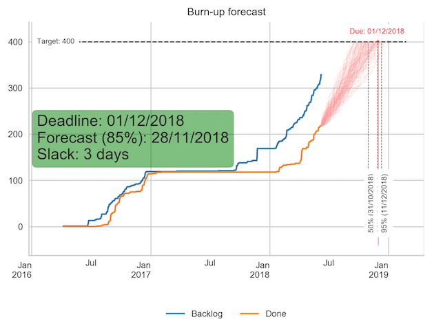

The simulation can be calibrated with a series of options to set:

- The number of trials to run. Each trial will be drawn as a hypotehtical
  burn-up to completion.
- The window of time from which to sample historical throughput. This should
  be representative of the near future, and ideally about 6-12 weeks long.
- The target to aim for, as a number of stories to have completed. Defaults
  to the size of the backlog, but can be set to an assumed figure.
- A deadline date, which, if set, can be compared to a forecast at a given
  confidence interval.

In the configuration file:

        Burnup forecast chart: burnup-forecast.png
        Burnup forecast chart title: Burn-up forecast
        Burnup forecast chart trials: 100 # number of Monte Carlo trials to run to estimate completion date

        Burnup forecast chart throughput window: 60 # Days in the past to use for calculating historical throughput
        Burnup forecast chart throughput window end: 2018-06-01 # Calculate throughput window to this date (defaults to last day of burnup)
        Burnup forecast chart target: 100 # items to complete in total; by default uses the current size of the backlog
        Burnup forecast chart deadline: 2018-06-01 # deadline date, in ISO format; if not set, no deadline is drawn.
        Burnup forecast chart deadline confidence: .85 # percentile to use to compare forecast to deadline

To only show the 30 most recent days in the chart:

        Burnup forecast window: 30

## Impediments

*Note this feature is not available in Trello.*

If you use the "Flagged" feature in JIRA to mark (and unmark) tickets as impeded
when they are blocked, you can produce charts showing the number of impediments
raised, and the cumulative amount of time tickets have spent being impeded,
broken down by month and either the flag set or the the workflow stage a ticket
was in when the flag was set. You can also write out the impediment events to a
file.


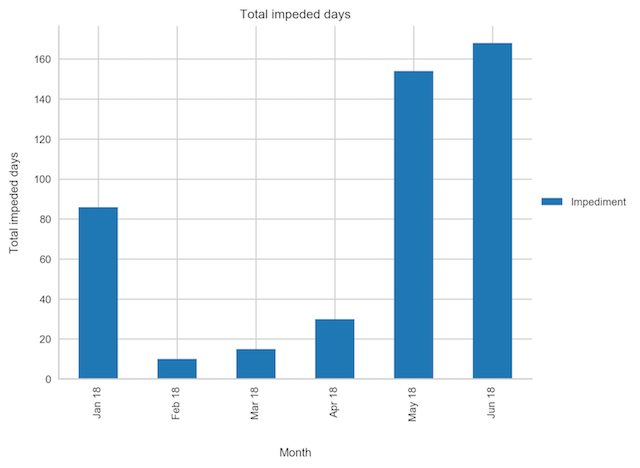


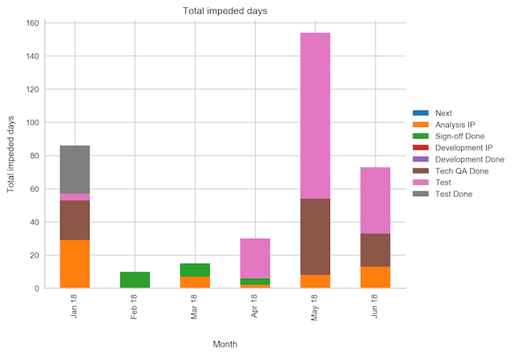

The charts can be enabled with:

    Impediments data: impediments.csv
    Impediments window: 6
    Impediments chart: impediments.png
    Impediments chart title: Number of impediments
    Impediments days chart: impediments-days.png
    Impediments days chart title: Total impeded days
    Impediments status chart: impediments-status.png
    Impediments status chart title: Number of impediments by status
    Impediments status days chart: impediments-status-days.png
    Impediments status days chart title: Total impeded days by status

Note that by default, only a single value (`"Impediment"`) is available for the
`Flagged` field in JIRA, and indeed only one field can be set when using the
`"Set flag"` option on a JIRA Agile board. However, you can enable additional
values in the field configuration for the relevant field, and make that field
available on the issue edit screen.

The `Impediments window`, which is optional, can be used to limit the chart to
showing only the most recent months' data: six in this case.

The `Impediments chart` and `Impediments status chart` will count the number of
impediment events that were active each month, i.e. a ticket was flagged as
impeded at some point during the month.

The `Impediments days chart` and `Impediments status days chart` uses the same
underlying logic, but instead of counting impediments, it sums the number of
days of all impediments in each month.

Note that:

- Impediments raised against tickets in the backlog or in the "done" column are
  not shown.
- If a ticket is flagged and then resolved before being unflagged, the impeded
  time is calculated to the resolution date.
- If a ticket is still flagged at the time the chart is generated, the impeded
  day count will run to today's date.
- Blocking time is always rounded up to the nearest whole day.

## Defect density

Three charts for analysing the amount of defects that have been open
historically, grouped in various ways into stacked bar graphs.

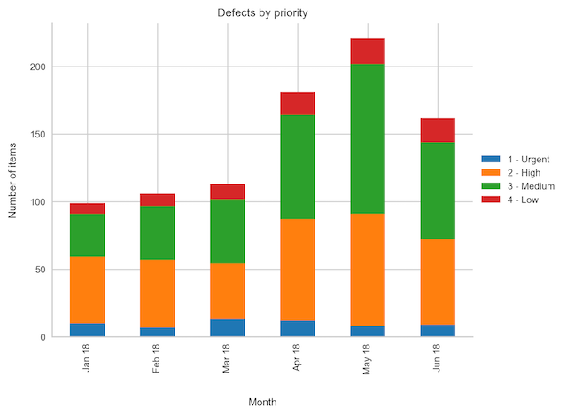

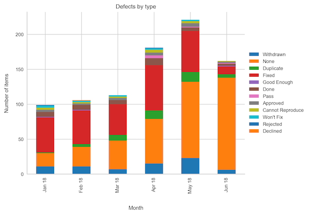

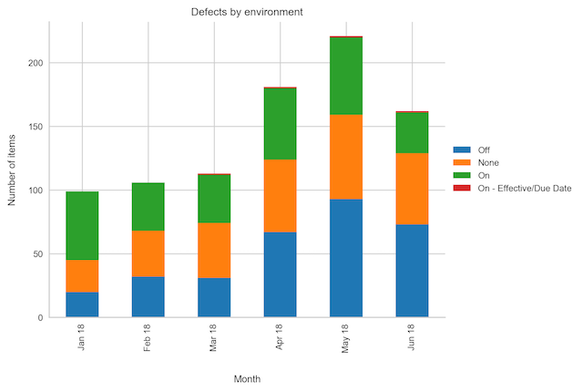

These charts all rely on a separate JIRA query:

    Defects query: issueType = Bug

Again, you can use the `filter=123` JQL syntax to delegate the query specifics
to a named filtered.

The three available groupings are:

- Show how many defects remained open each month, grouped by _priority_.
- Show how many defects remained open each month, grouped by _type_.
- Show how many defects remained open each month, grouped by _environment_.

They each require you to specify the name of the relevant field, and a chart
output. You can also optionally specify a list of allowed values for each field,
which lets you control the order. Finally, you can specify a "window" of how
many of the most recent months to show (the default is to show all months for
which there is data). Here is an example that enables all charts, and limits to
showing the six most recent months in each:

    Defects query: issueType = Bug
    Defects window: 6
    Defects priority field: Priority
    Defects priority values:
        - Low
        - Medium
        - High
    Defects type field: Root cause
    Defects type values:
        - Config
        - Data
        - Code
    Defects environment field: Environment
    Defects environment values:
        - SIT
        - UAT
        - PROD

    Defects by priority chart: defects-by-priority.png
    Defects by priority chart title: Defects by priority
    Defects by type chart: defects-by-type.png
    Defects by type chart title: Defects by type
    Defects by environment chart: defects-by-environment.png
    Defects by environment chart title: Defects by environment

If you omit any of the chart names, the relevant chart will not be produced. If
you omit any of the field names, the relevant chart will not be stacked. If you
omit the values list, all unique values will be shown.

### Defects in Trello

As Trello does not have different issue types you need to use a different way 
of identifying failure demand. The tool allows you to map a Trello label to an
issue type:

    Type Mapping:
        Defect:
            - bug

This allows you to analyse failure demand separately from value demand in
ActionableAgile:

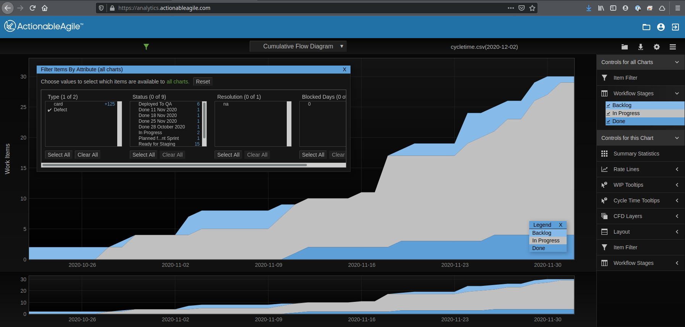
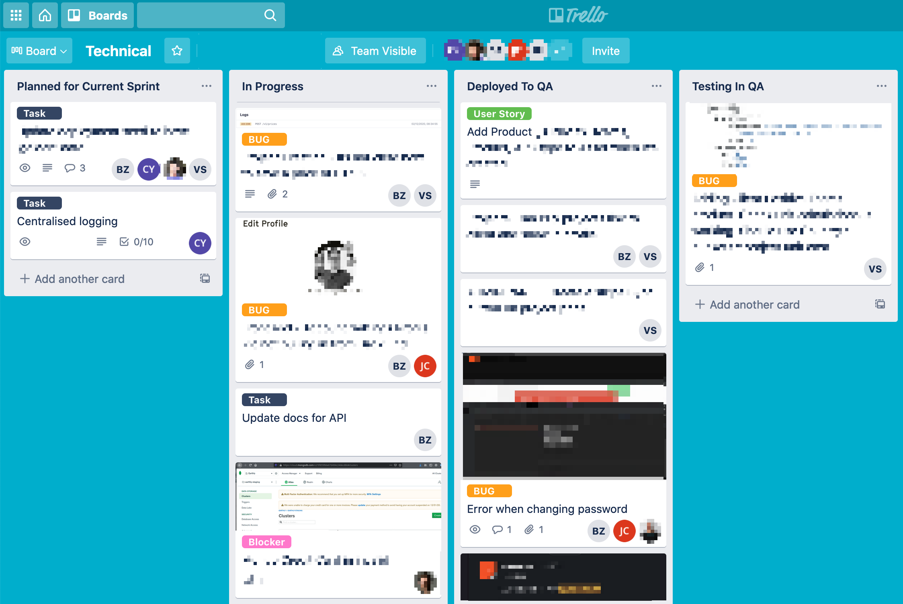

## Technical debt

Two charts that show the nature and age of recorded (unresolved) technical debt.

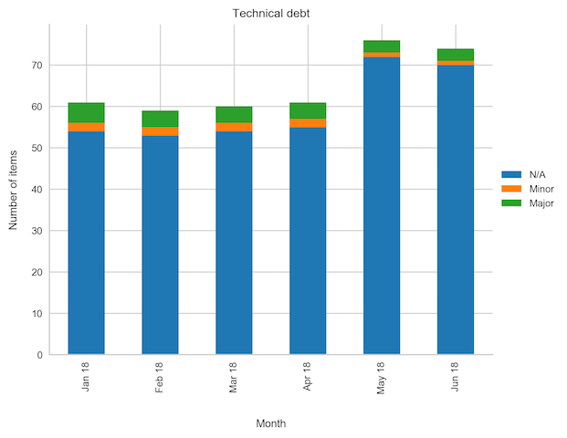

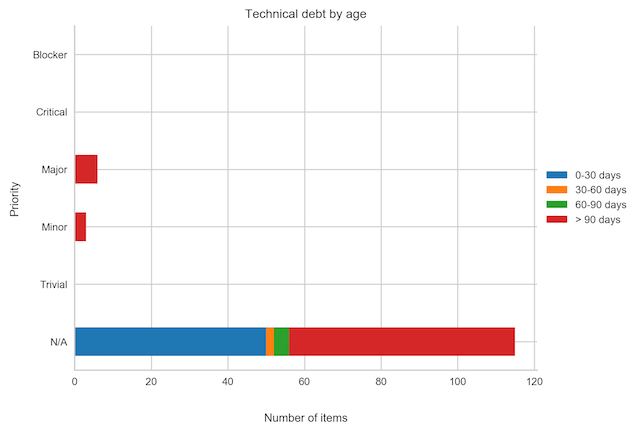

These require a separate JIRA query. You should also identify the field
indicating priority:

    Debt query: issueType = "Tech debt"
    Debt priority field: Priority
    Debt priority values:
        - Low
        - Medium
        - High

As ever, use `filter=123` to use a named filter instead. If you omit the
`Debt priority values` option, all unique priority values will be used, in
alphabetical order.

The first chart shows the open technical debt items each month as a stacked bar
chart grouped by priority. You can optionally specify a "window" to show only
a limited number of the most recent months:

    Debt window: 3
    Debt chart: tech-debt.png
    Debt chart title: Technical debt

The second chart shows the number of open technical debt items by their current
age in days, broken down by priority, and stacked into "bins":

    Debt age chart: tech-debt-age.png
    Debt age chart title: Technical debt age
    Debt age chart bins:
        - 30
        - 60
        - 90

This will use the age brackets 0-30 days, 31-60 days, 61-90 days, and over 90
days (which also happens to be the default).

## Waste (withdrawn items)

This chart shows how many work items are withdrawn or cancelled after work
has started. It relies on a separate JIRA query, and assumes that withdrawn
work items are all "resolved" in JIRA. Moreover, it assumes that these work
items follow the same workflow as that used for the other charts and files,
i.e. as mapped in the `Workflow` section of the configuration file.


Here is an example:

    Waste query: issueType = Story AND resolution IN (Withdrawn, Invalid)
    Waste window: 10
    Waste frequency: 2W-WED
    Waste chart: waste.png
    Waste chart title: Waste

This will show withdrawn items broken down by the period in which they were
withdrawn for the the 10 most recent periods. The default period length is
monthlyasfd, but here we have set it to `2W-WED`, which means a two-week period
starting on a Wednesday. `Waste window` and `Waste frequency` are both
optional.

## Progress report

An status report that uses Monte Carlo simulation forecasting at the epic
level.

The report is presented as a self-contained HTML file with embedded
images. It relies on a small number of commonly used, externally hosted
libraries (the *Bootstrap* CSS/JS library and its *jQuery* dependency; the
*Fontawesome* icon font), but can be served from any static web server or opened
as a local file on any modern web browser. It should also print reasonably well,
although the embedded images showing context-specific Cumulative Flow Diagrams
and Cycle Time Scatter Plots are only accessible by clicking on the relevant
icons in a browser.

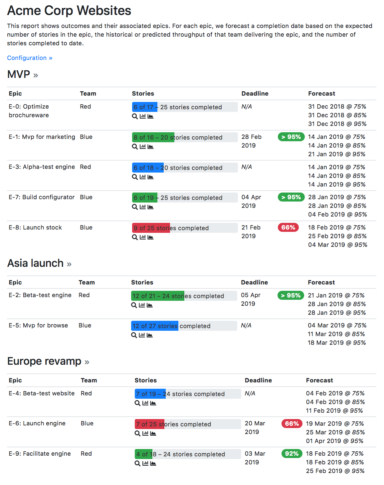

The status report is based on the principle of *outcomes* (e.g. projects,
releases, objectives) that are broken down into *epics*, which will eventually
be further broken down into *stories*. Epics are assumed to be fully owned by
exactly one *team*. Epics and stories are represented by JIRA tickets
discoverable by JQL queries specified in the configuration file, whereas
outcomes and teams are enumerated in the configuration file directly.

A forecast to complete is then produced for each epic by calculating:

- the presumed number of stories in the epic (randomly sampling between a
  minimum and maximum number of stories as set on the epic ticket in JIRA, or
  using the total number of stories raised against the epic, if higher);
- the number of stories raised against the epic that have been completed to
  date;
- and the presumed throughput of the relevant team (randomly sampled, either
  from a range of the minimum to maximum number of stories the team can complete
  per week, or through a JQL query that identifies the team's historical
  performance).
  
This is done many times over in a Monte Carlo simulation, to identify a range of
plausible completion dates. If a deadline is set on an epic, the forecast to
complete will be compared with it, to highlight the likelihood of hitting the
deadline. (Deadlines may also be set at the outcome-level, in which case the
outcome deadline is the default for all epics.)

The simulation takes into account that a single team may have multiple epics to
complete. A team can be configured to have an epic WIP limit of 1 (the default)
or more. If the team is working on more than one epic at a time, it is assumed
to distribute its throughout roughly evenly across all active epics, and to work
through the epics in the order in which their respective outcomes are listed in
the configuration file, and then in the order in which they are returned by the
query used to find them.

Here is a complete example configuration file that produces a report akin to
the screenshot above:

    Connection:
        # not shown
    
    # ...

    # Used for calculating progress against an epic, and team throughput: to
    # identify whether stories are in the backlog, in progress, or completed.
    Workflow:
        Backlog: Backlog
        Committed: Next
        Build: Build
        Test:
            - Code review
            - QA
        Done: Done

    Output:
        # Used to determine which percentiles to show in the forecast
        Quantiles:
            - 0.75
            - 0.85
            - 0.95

        # The name of the file to write. If not set, the progress report will
        # not be produced
        Progress report: progress.html

        # Report title
        Progress report title: Acme Corp Websites

        # Names of JIRA fields on epics, used to determine the deadline, team,
        # and min/max stories. All are optional:

        # - if no deadline field is set, the report will not include any
        #   deadline calculations
        Progress report epic deadline field: Due date

        # - if no team field is set, you must specify exactly one team under
        #   `Progress report teams`, which will be used for all epics
        Progress report epic team field: Team

        # - if no min stories field is set, the story count will be based solely
        #   on the number of stories raised against each epic, rather than an
        #   estimated range; if no max stories field is set, the min stories
        #   field will be used to identify an absolute value
        Progress report epic min stories field: Min stories
        Progress report epic max stories field: Max stories

        # The query used to identify epics for each outcome. The special
        # placeholder `{outcome}` will be replaced by the outcome key (or name,
        # if the key is not set). May be overridden by the `Epic query` set on
        # an individual outcome. If not set, the `Epic query` must be specified
        # on each outcome, and it is not possible to use outcomes as tickets.
        Progress report epic query template: project = ABC AND type = Epic AND Outcome = {outcome} ORDER BY created

        # The query used to identify stories for an epic. The placeholders
        # `{epic}`, `{outcome}`, and `{team}` may be used to parameterise the
        # query.
        Progress report story query template: project = ABC AND type = Story AND "Epic link" = {epic}

        # A list of teams. At least one team is required, and each team must
        # have a `Name` and *either* `Min throughput` and `Max throughput`
        # (stories per week), *or* a query in `Throughput samples`. `WIP`
        # (number of epics the team may work on in parallel) and
        # `Throughput samples window` (number of weeks in the past from which to
        # draw samples) are optional. The placeholder `{team}` can be used to
        # reference the team name in the samples query.
        Progress report teams:
            - Name: Red
              Min throughput: 5
              Max throughput: 10
            - Name: Blue
              WIP: 2
              Throughput samples: project = ABC AND type = Story AND Team = {team}
              Throughput samples window: 6

        # A list of outcomes. May be omitted, in which case epics will not be
        # grouped into outcomes and the `Progress report epic query template`
        # specifies a non-parameterised query for all relevant epics. If
        # included, each outcome must have a `Name`. `Key`, which is used in
        # the epic query template, is optional, defaulting to the same value as
        # `Name`. `Deadline` can be used to specify a deadline for all epics
        # in the report, which can be overridden on a per-epic basis.
        # `Epic query` may be used to specify a particular query for
        # epics, overriding the more general `Progress report epic query template`.
        Progress report outcomes:
            - Name: MVP
              Key: O1
              Deadline: 2019-01-01
            - Name: Asia launch
              Key: O2
            - Name: Europe revamp
              Key: O3
              Epic query: project = ABC and type = Feature

In this example, we have listed the outcomes explicitly in the configuration
file. It is also possible for the outcomes to be managed as JIRA ticket (or even
to mix the two approaches). To do this, you need to specify a query for finding
the outcomes:

        Progress report outcome query: project = ABC AND type = Outcome AND resolution IS EMPTY ORDER BY summary

        # Optionally give a field name for the outcome-level deadline, which
        # will be used as a fallback if epic-level deadlines are not set
        Progress report outcome deadline field: Due date

If using tickets to specify outcomes, `Progress report epic query template` must
be set. The `{outcome}` placeholder will be replaced by the relevant outcome
ticket `key`. You can thus use a linked issue field to specify the outcome.

In a simpler use case, you can model a single team performing all work, and/or
dispense with the "outcome" level entirely, modelling only epics. The estimated
min/max story count and the entire concept of deadlines are also optional.

Here is a minimal example:

    # ...

    Workflow:
        Backlog: Backlog
        Committed: Next
        Build: Build
        Test:
            - Code review
            - QA
        Done: Done

    Output:

        Quantiles:
            - 0.75
            - 0.85
            - 0.95

        Progress report: progress-minimal.html
        Progress report title: Acme Corp Websites
        Progress report epic min stories field: Story count
        Progress report epic query template: project = ABC AND type = Epic AND resolution IS EMPTY ORDER BY created
        Progress report story query template: project = ABC AND type = Story AND "Epic link" = {epic}
        Progress report teams:
            - Name: Default
              Min throughput: 5
              Max throughput: 10

You can also turn off forecasts for some or all teams, if you don't have
confidence in the predictability of team pace or in the underlying data quality.
You will still get the progress bars and charts. In this case, you can either
omit the `Min throughput` / `Max throughput` fields for a specific team, or 
omit the `Progress report teams` section in its entirety.
Team names will be taken from the relevant field on epics (presuming an epic
team field name is specified):

    # ...

    Workflow:
        Backlog: Backlog
        Committed: Next
        Build: Build
        Test:
            - Code review
            - QA
        Done: Done

    Output:

        Quantiles:
            - 0.75
            - 0.85
            - 0.95

        Progress report: progress-teams.html
        Progress report title: Acme Corp Websites
        Progress report epic min stories field: Story count
        Progress report epic query template: project = ABC AND type = Epic AND resolution IS EMPTY ORDER BY created
        Progress report story query template: project = ABC AND type = Story AND "Epic link" = {epic}
        Progress report epic team field: Team

Technically you can omit both the teams list (so no forecasts) and the team
field name, in which case you just get a breakdown of the epics with no
forecasting or grouping.

Also note that if you do specify a list of teams and an epic team field, the
list of teams will be automatically extended with any team names found that are
not explicitly listed in the configuration.

## More details about the configuration file format

The configuration file is written in YAML format. If you are unfamiliar with
YAML, know that:

* Comments start with `#`
* Sections are defined with a name followed by a colon, and then an indented
  block underneath. `Connection`, `Output`, `Workflow` and `Attributes` area
  all sections in the example above.
* Indentation has to use spaces, not tabs!
* Single values can be set using `Key: value` pairs. For example,
  `Burnup chart: burnup.png` above sets the key `Burnup chart` to the value
  `burnup.png`.
* Lists of values can be set by indenting a new block and placing a `-` in front
  of each list value. In the example above, the `QA` list contains
  the values `Code review` and `Test`.

The sections for `Workflow` is required. Additionally, you must either specfiy a
single `Query`, or a block of `Queries` (see below). Connection details must
be set either in the `Connection` file or as command line arguments.

Under `Workflow`, at least two steps are required. Specify the steps in order.
You may either specify a single workflow value or a list (as shown for `QA`
above), in which case multiple JIRA statuses will be collapsed into a single
state for analytics purposes.

The file, and values for things like workflow statuses and attributes, are case
insensitive.

### Extracting additional attributes

You may want to add additional fields to the cycle time output data. Use an
`Attributes` block to do this:

    Attributes:
        Priority: Priority
        Release: Fix version/s
        Team: Team name

Here, three additional columns will be added: `Priority`, `Release` and `Team`,
corresponding to the JIRA fields `Priority`, `Fix version/s` and `Team name`,
respectively.

When specifying attributes, use the *name* of the field (as rendered on screen
in JIRA), not its id (as you might do in JQL), so e.g. use `Component/s` not
`components`.

The attributes `Type` (issue type), `Status` and `Resolution` are always
included.

### Multi-valued fields

Some fields in JIRA can contain multiple values, e.g. `fixVersion`. By default,
the extractor will use the first value in such a field if one is specified in
the `Attributes` block. However, you may want to extract only specific values.

To do so, add a block like the following::

    Attributes:
        Release: Fix version/s

    Known values:
        Release:
            - "R01"
            - "R02"
            - "R03"

The extractor will pick the first "known value" found for the field. If none of
the known values match, the cell will be empty.

### Combining multiple queries

If it is difficult to construct a single set of criteria that returns all
required issues, multiple queries can be added into a `Queries` block, like so:

    Queries:
        Attribute: Team
        Criteria:
            - Value: Team 1
              JQL: (filter=123)

            - Value: Team 2
              JQL: (filter=124)

In this example, two queries will be run, based on the two filters `123` and
`124` (you can use any valid JQL).

In the cycle time output, a new column called `Team` will be added, as specified
by the `Attribute` field under `Queries`. For all items returned by
the first query, the value will be `Team 1` as per the `Value` field, and for
all items returned by the second query, it will be `Team 2`.

## Troubleshooting

* If Excel complains about a `SYLK` format error, ignore it. Click OK. See
  https://support.microsoft.com/en-us/kb/215591.
* JIRA error messages may be printed out as HTML in the console. The error is
  in there somewhere, but may be difficult to see. Most likely, this is either
  an authentication failure (incorrect username/password or blocked account),
  or an error in the `Query` option resulting in invalid JQL.
* If you aren't getting the issues you expected to see, use the `-v` option to
  see the JQL being sent to JIRA. Paste this into the JIRA issue filter search
  box ("Advanced mode") to see how JIRA evaluates it.
* Old workflow states can still be part of an issue's history after a workflow
  has been modified. Use the `-v` option to find out about workflow states that
  haven't been mapped.
* Excel sometimes picks funny formats for data in CSV files. Just set them to
  whatever makes sense.
* If you are on a Mac and you get an error about Python not being installed as
  a framework, try to create a file `~/.matplotlib/matplotlibrc` with the
  following contents:

    backend : Agg

* To install the charting dependencies on a Mac, you might need to install a
  `gfortran` compiler for `scipy`. Use [Homebrew](http://brew.sh) and install the
  `gcc` brew.

## Output settings reference

The following options can be set in the `Output:` section of the configuration
file.

### General options

These options affect multiple charts and files.

- `Quantiles: <list>` – Quantiles to use when calculating percentiles.
- `Backlog column: <name>` --Name of the backlog column. Defaults to the first column.
- `Committed column: <name>` – Name of the column from which work is considered
   committed. Defaults to the second column.
- `Final column: <name>` – Name of the final 'work' column. Defaults to the
   penultimate column.
- `Done column: <name>` – Name of the 'done' column. Defaults to the last column.

### Data files

These options name data files to write. Use an extension of `.csv`, `.xlsx`, or
`.json` according to the required file format. May be specified as either a list
of filenames, or a single filename.

- `Cycle time data: <filename>.[csv,xlsx,json]` – Output file suitable for
   processing Actionable Agile. Contains all issues described by the
   configuration file, metadata, and dates of entry to each state in the cycle.
- `CFD data: <filename>.[csv,xlsx,json]` – Calculate data to draw a Cumulative
   Flow Diagram and write to file. Hint: Plot as a (non-stacked) area chart.
- `Scatterplot data: <filename>.[csv,xlsx,json]` – Calculate data to draw a
   cycle time scatter plot and write to file. Hint: Plot as a scatter chart.
- `Histogram data: <filename>.[csv,xlsx,json]` – Calculate data to draw a cycle
   time histogram and write to file. Hint: Plot as a column chart.
- `Throughput data: <filename>.[csv,xlsx,json]` – Calculate daily throughput
   data and write to file. Hint: Plot as a column chart. Respects the
   `Throughput frequency` setting (see below).
- `Percentiles data: <filename>.[csv,xlsx,json]` – Calculate cycle time
   percentiles and write to file.
- `Impediments data: <filename>.[csv,xlsx,json]` – Output impediment start and
   end dates against tickets.

### Scatterplot chart

- `Scatterplot window: <number>` – Number of recent days to show in scatterplot.
   Defaults to showing all data.
- `Scatterplot chart: <filename>.png` – Draw cycle time scatter plot.
- `Scatterplot chart title: <title>` – Title for cycle time
   scatter plot.

### Histogram chart

- `Histogram window: <number>` – Number of recent days to show in histogram.
   Defaults to showing all data.
- `Histogram chart: <filename>.png` – Draw cycle time histogram.
- `Histogram chart title: <title>` – Title for cycle time
   histogram.

### Cumulative Flow Diagram

- `CFD window: <number>` – Number of recent periods to show in the CFD.
   Defaults to showing all periods.
- `CFD chart: <filename>.png` – Draw Cumulative Flow Diagram.
- `CFD chart title: <title>` – Title for the CFD.

### Throughput chart

- `Throughput frequency: <freq>` – Interval to use for calculating frequency,
   e.g. 1D for daily or 1W for weekly.
- `Throughput window: <number>` – Number of recent periods to show in throughput chart.
   Defaults to showing all periods.
- `Throughput chart: <filename>.png` – Draw weekly throughput chart with trend
  line.
- `Throughput chart title: <title>` – Title for throughput chart.

### Burnup chart

- `Burnup window: <number>` – Number of recent periods to show in burnup.
   Defaults to showing all periods.
- `Burnup chart: <filename>.png` – Draw simple burn-up chart.
- `Burnup-chart-title <title>` – Title for burn-up charts_scatterplot.

### Burnup forecast chart

- `Burnup forecast window: <number>` – Number of recent periods to show in the
   burnup forecast chart. Defaults to showing all periods.
- `Burnup forecast chart: <filename>.png` – Draw burn-up chart with Monte Carlo
   simulation forecast to completion.
- `Burnup forecast chart title: <title>` – Title for burn-up forecast chart.
- `Burnup forecast chart target: <number>` – Target completion scope for
   forecast. Defaults to current size of backlog.
- `Burnup forecast chart deadline: <date>` – Deadline date for completion of
   backlog. If set, it will be shown on the chart, and the forecast delta will
   also be shown. Use ISO date format, e.g. `2018-01-02` for January 2nd 2018.
- `Burnup forecast chart deadline confidence: <number>` – Quantile to use when
   comparing deadline to forecast. Use a fraction, e.g. `0.85`.
- `Burnup forecast chart trials: <number>` – Number of iterations in Monte
   Carlo simulation.
- `Burnup forecast chart throughput window: <number>` – How many days in the
   past to use for calculating throughput.
- `Burnup forecast chart throughput window end: <date>` – By default, the
   throughput window runs to today's date. Use this option to set an alternative
   end date for the window. Use ISO date format, e.g. `2018-01-02` for January
   2nd 2018.

### WIP chart

- `WIP frequency: <freq>` – Frequency interval for WIP chart. `1W-Mon`
   means 1 week, starting Mondays.
- `WIP window: <number>` – Number of recent periods to show in WIP chart.
   Defaults to showing all periods.
- `WIP chart: <filename>.png` –  Draw weekly WIP box plot.
- `WIP chart title: <title>` – Title for WIP chart

### Ageing WIP chart

- `Ageing WIP chart: <filename>.png` – Draw current ageing WIP chart.
- `Ageing WIP chart title: <title>` – Title for ageing WIP chart.

### Net flow chart

- `Net flow frequency: <freq>` – Frequency interval for net flow chart.
  `1W-Mon` means 1 week, starting Mondays.
- `Net flow window: <number>` – Number of recent periods to show in net flow
   chart. Defaults to showing all periods.
- `Net flow chart: <filename>.png` – Draw weekly net flow bar chart.
- `Net flow chart title: <title>` – Title for net flow bar chart.

## Impediments chart

- `Impediments window: <number>` – How many months to show.
- `Impediments chart: <filename>.png` – Draw a bar chart of the number of
  active impediments during each month, stacked by the impediments flag set.
- `Impediments chart title: <title>` – Title for the impediments chart.
- `Impediments days chart: <filename>.png` – Draw a bar chart of the total
   number of days of all the impediments active during each month, stacked by
   the impediments flag set.
- `Impediments days chart title: <title>` – Title for the impediments days
   chart.
- `Impediments status chart: <filename>.png` – Draw a bar chart of the number of
  active impediments during each month, stacked by the ticket status at the
  time the impediment was raised.
- `Impediments status chart title: <title>` – Title for the impediments status
   chart.
- `Impediments status days chart: <filename>.png` – Draw a bar chart of the
   total number of days of all the impediments active during each month, stacked
   by the ticket status at the time each impediment was raised.
- `Impediments status days chart title: <title>` – Title for the impediments
   status days chart.


### Defect density charts

- `Defects query: <query>` – JQL query used to identify defects.
- `Defects window: <number>` – How many months to show.
- `Defects priority field: <fieldname>` – Name of field identifying
   defect priority.
- `Defects priority values: <list>` – List of valid values, in order,
   for defect priorities.
- `Defects type field: <fieldname>` – Name of field identifying defect
   type.
- `Defects type values: <list>` – List of valid values, in order, for
   defect values.
- `Defects environment field: <fieldname>` – Name of field identifying
   the environment in which a defect was discovered.
- `Defects environment values: <list>` – List of valid values, in
   order, for defect environments.

- `Defects by priority chart: <filename>.png` – Draw stacked bar chart of
   defects grouped by priority over time.
- `defects-by priority chart title: <title>` – Title for defects-by-priority
   chart.

- `Defects by type chart: <filename>.png` – Draw stacked bar chart of defects
   grouped by type over time.
- `Defects by type chart title: <title>` – Title for defects-by-type chart.

- `Defects by environment chart: <filename>.png` – Draw stacked bar chart of
   defects grouped by environment over time.
- `Defects by environment chart title: <title>` – Title for defects-by-
   environment chart.

### Debt density chart

- `Debt query: <query>` – JQL query used to identify technical debt items.
- `Debt window: <number>` – How many months to show in the debt chart. Defaults
   to showing all months for which there is data.
- `Debt priority field: <fieldname>` – Name of field identifying technical debt
   item priority.
- `Debt priority values: <list>` – List of valid values, in order, for
   technical debt item priorities.

- `Debt chart: <filename>.png` – Draw a stacked bar chart of technical debt
   grouped by priority over time.
- `Debt chart title: <title>` – Title for the technical debt chart.

- `Debt age chart: <filename>.png` – Draw a stacked bar chart of technical debt
   grouped by priority by age.
- `Debt age chart title: <title>` – Title for the technical debt age chart.
- `Debt age chart bins: <list>` – List of bins for bracketing the ages shown.
   Defaults to `30`, `60`, and `90`, which will group ages into `0-30 days`,
   `31-60 days`, `61-90 days` and `91 days or more`.

### Waste chart

- `Waste query: <query>` – JQL query used to identify waste items, e.g.
   those withdrawn after work has begun.
- `Waste frequency: <freq>` – Frequency to group waste chart by. Defaults to
   month start (`MS`). Use e.g. `2W-WED` to group by fortnight starting
   Wednesday.
- `Waste window: <number>` – How many months to show.
- `Waste chart: <filename>.png` – Draw a stacked bar chart of wasted items,
   grouped by last non-resolved status.
- `Waste chart title: <title>` – Title for the waste chart.

### Progress report

- `Progress report: <filename>.html` – Write progress report to a standalone
   HTML file.
- `Progress report title: <title>` – Title of the progress report page.
- `Progress report epic deadline field: <fieldname>` – Name of a date field
   giving the deadline of an epic.
- `Progress report epic team field: <fieldname>` – Name of a field giving the
   name of the team responsible for an epic.
- `Progress report epic min stories field: <fieldname>` – Name of an integer
   field giving the minimum number of stories expected for an epic, for
   forecasting purposes.
- `Progress report epic max stories field: <fieldname>` – Name of an integer
   field giving the maximum number of stories expected for an epic, for
   forecasting purposes.
- `Progress report epic query template: <query>` – Query used to identify epics
   for an outcome. The placeholder `{outcome}` will be substituted for the given
   outcome key (if set) or name.
- `Progress report story query template: <query>` – Query used to identify
   stories for an epic. The placeholder `{epic}` will be substituted for the
   given epic key (JIRA reference). The placeholders `{outcome}` and `{team}`
   may also be used to identify the outcome key/name and team name, respectively.
- `Progress report teams: <list>` – A list of records with keys `Name`, `WIP`,
   `Min throughput`, `Max throughput`, `Throughput samples` and/or
   `Throughput samples window` which specify the teams that may be associated
   with epics. `Name` is required, and you can specify either
   `Min/Max throughput` (numeric values, in stories per week) or
   `Throughput samples`, which is a JQL query to identify stories for the given
   team for the purpose of calculating historical throughput. If
   `Throughput samples window` is given, it specifies the number of weeks into
   the past (from today's date) to use when calculating historical throughput.
   You can use the placeholder `{team}` in `Throughput samples` as a shortcut
   to repeating the team name. `WIP` defaults to 1.
- `Progress report outcomes: <list>` – A list of records with keys `Name`,
  `Key`, `Deadline`, and/or `Epic query`, which specify the outcomes to list on
  the progress report. `Key` will default to the same value as `Name`.
  `Deadline` will be used as a fallback if an epic level deadline is not set.
  `Epic query`, if given, takes precedence over
  `Progress report epic query template` when finding epics for this outcome.
- `Progress report outcome query: <query>` – Allows outcomes to be enumerated
  in JIRA issues, rather than the `Progress report outcomes` list. Each matching
  issue will be used as an outcome, with the outcome key for the epic query
  template being the issue key and the issue summary being the outcome title.
  If used, `Progress report epic query template` *must* be set.
- `Progress report epic deadline field: <fieldname>` – Name of a date field
   giving the deadline of an outcome. Used as a fallback if no epic-level
   deadline is set. Optional.

## Changelog

### 0.25

- Added suppport for Trello.

### 0.24

- Allow using either field id or title for field names in the progress report.
- Fix several errors that would occur when running with no defined teams or
  outcomes in the configuration file.

### 0.23

- Allow deadline to be set on outcomes as a fallback for epic level deadlines
- Add support for `Progress report outcome query` and
  `Progress report outcome deadline field`.
- Allow progress report to run without a forecast for some/all teams.
- Allow progress report to be run without teams being explicitly defined.
  Team names are picked up from the epic teams field if specified, and no
  forecasting will take place for such teams.
- Add target and deadline lines to epic level CFDs in progress report.
- Add out-come level CFD in progress reports.

### 0.22

- Add support for `Extends` in config file.
- Allow `-o` as an alias for `--output-directory`

### 0.21

- Allow progress report output to be viewed by team as well as by outcome.

### 0.20

- Use a cumulative distribution function definition of a percentile when
  calculating chance of hitting the deadilne (basically: if the deadline is
  in the same week as the forecast worst case date, treat it as 100% not 50%
  likely)

### 0.19

- Fix a crash with newer versions of Pandas calculating CFD charts

### 0.18

- Don't show a forecast for epics that are complete

### 0.17

- Make logging output date/time and logging level again for easier debugging

### 0.16

- Attempted fix for throughput calculator crashing in some edge cases


### 0.15

- Brown bag


### 0.14

- Force min/max stories fields to integers even if string fields in JIRA
- Log which state change caused a backward move

### 0.13

- Make sure change history is always iterated in date order, even if JIRA returns
  them differently.

### 0.12

- Preserve background colour in print CSS for progress report
- Allow use of `{team}` placeholder in team throughput sample query.

### 0.11

- Added progress report calculator
- Fixed issue with web server where template would not load if the package was
  installed as an egg (i.e. not from source)

### 0.10

* Make it possible to optionally specify multiple output files (via YAML lists)
  for `* data:` file names. The use case here is to output both a CSV/XLSX and
  JSON version of the `cycletime` calculations, for example.
* Stop swallowing exceptions in calculators (but keep on doing so when writing
  output files). It's too confusing to debug problems.

### 0.9

* Made the default impediments charts use the impeded flag value as breakdown,
  and added specific `Impediments status *` charts for breakdown by status.

### 0.8

* Added `--http-proxy` and `--https-proxy` options to command line, and
  corresponding `HTTP Proxy` and `HTTPS Proxy` in the `Connection` section.

### 0.7

* Turn throughput chart into a line chart

### 0.6

* Don't log every list value resolution at debug

### 0.5

* Added batch mode docker image

### 0.4

* Added impediments charts

### 0.3

* Added debt, defects, and waste charts.
* Added `window` options to most charts.

### 0.2

* Added `--output-directory` option.

### 0.1

* Forked from `jira-agile-metrics`
